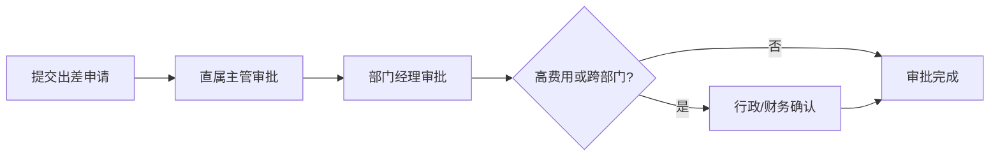

# 星云智联科技有限公司 出差审批流程

| 版本 | 生效日期 |
| --- | --- |
| V1.0 | 2024-01-01 |

---

## 一、流程说明

员工因公出差须在 OA 提交出差申请，经主管、部门经理审批，必要时加签行政或财务。

## 二、审批流程图

```text
员工提交出差申请
    ↓
直属主管审批
    ↓
部门经理审批
    ↓
行政/财务确认（高费用/跨部门时）
    ↓
审批完成
```

### 标准流程图（mermaid）



## 三、审批节点与规则

| 节点 | 审批人 | 说明 |
| --- | --- | --- |
| 1 | 直属主管 | 确认出差必要性与事由 |
| 2 | 部门经理 | 统筹安排与预算 |
| 3 | 行政/财务 | 预估费用较高或涉及跨部门时加批 |

## 四、申请内容

- 出差事由、起止时间、目的城市、行程安排、预算预估。

## 五、退回 / 转办

- 审批人可退回并说明原因；超时自动转办至上一级。

## 六、注意事项

- 审批通过后按标准预订机票、酒店，详见《02-03 出差管理制度》与《04-01 差旅报销制度》。
- 紧急出差可先报备后补流程（3 个工作日内）。
- 报销时须关联对应出差申请。