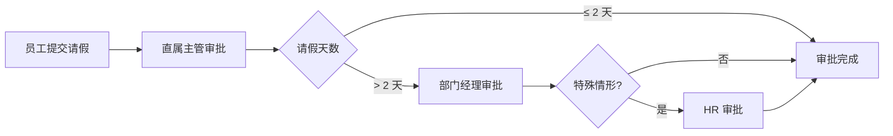

# 星云智联科技有限公司 请假审批流程

| 版本 | 生效日期 |
| --- | --- |
| V1.0 | 2024-01-01 |

---

## 一、流程说明

员工请假须在 OA 平台提交请假申请，经逐级审批通过后方可休假。审批层级根据请假天数与类型调整。

## 二、审批流程图

```text
员工提交申请
    ↓
直属主管审批
    ↓
部门经理审批（请假超过 2 天时）
    ↓
HR 审批（长假期/特殊情形）
    ↓
审批完成
```

### 标准流程图（mermaid）



## 三、审批节点与规则

| 节点 | 审批人 | 说明 |
| --- | --- | --- |
| 1 | 直属主管 | 所有请假必经 |
| 2 | 部门经理 | 请假超过 2 天时加批 |
| 3 | 人力资源部 | 长假（____ 天以上）或特殊情形加批 |

### 审批层级规则

- 请假 **2 天及以内**：直属主管 → 审批完成。
- 请假 **超过 2 天**：直属主管 → 部门经理 → 审批完成。
- 特殊情形（如产假、长期病假等）：加签人力资源部。

## 四、申请材料

- 按请假类型提供证明：病假（医院证明）、婚假（结婚证）、产假（生育证明）等，详见《02-02 请假管理制度》。

## 五、退回 / 转办 / 超时

- 审批人可**退回**申请并填写原因，申请人修改后可重新提交。
- 因主管不在导致超时，系统将自动**转办**至上一级或指定处理人。
- **审批时限**：每个节点原则上 1~2 个工作日内完成。

## 六、注意事项

- 未审批通过前擅自离岗按旷工处理。
- 请假期满未按时返岗，须及时续假并说明原因。