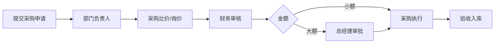

# 星云智联科技有限公司 采购审批流程

| 版本 | 生效日期 |
| --- | --- |
| V1.0 | 2024-01-01 |

---

## 一、流程说明

采购需求须在 OA 提交采购申请，经部门负责人、采购、财务审核，大额采购由总经理审批。

## 二、审批流程图

```text
申请人提交采购申请
    ↓
部门负责人审批
    ↓
采购部门处理（比价）
    ↓
财务审核预算
    ↓
总经理审批（超限金额）
    ↓
采购执行 → 验收入库
```

### 标准流程图（mermaid）



## 三、审批节点与规则

| 节点 | 审批人 | 说明 |
| --- | --- | --- |
| 1 | 部门负责人 | 采购必要性与合理性 |
| 2 | 采购部门 | 供应商比价、询价（多选） |
| 3 | 财务 | 预算与资金安排 |
| 4 | 总经理 | 金额超过阈值时加批 |

### 金额分级

- 小额（≤ ____ 元）：采购直接执行。
- 大额（> ____ 元）：加签总经理。

## 四、比价 / 询价要求

- 超过一定金额的采购须提供至少 **2~3 家**供应商比价。

## 五、验收入库

- 到货后由行政或使用部门验收登记，并关联固定资产/库存台账（如设备采购）。

## 六、注意事项

- 未审批的采购费用不列入报销。
- 采购申请与报销流程关联，见《03-02 报销审批流程》。