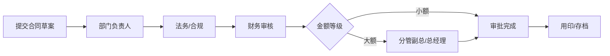

# 星云智联科技有限公司 合同审批流程

| 版本 | 生效日期 |
| --- | --- |
| V1.0 | 2024-01-01 |

---

## 一、流程说明

公司对外签订合同须在 OA 发起合同审批，经部门负责人、法务/合规、财务等审核，重大合同由总经理签署。

## 二、审批流程图

```text
申请人提交合同草案
    ↓
部门负责人审批
    ↓
法务/合规审核
    ↓
财务审核
    ↓
分管副总/总经理（分级）
    ↓
审批完成 → 用印/存档
```

### 标准流程图（mermaid）



## 三、审批节点与规则

| 节点 | 审批人 | 说明 |
| --- | --- | --- |
| 1 | 部门负责人 | 业务内容与商务条款 |
| 2 | 法务/合规 | 合同条款合法性、风险审核 |
| 3 | 财务 | 金额、付款条件、预算 |
| 4 | 分管副总/总经理 | 大额或重大合同签署 |

### 金额分级规则

- **不超过 ____ 万元**：部门负责人 → 法务 → 财务 → 完成。
- **超过 ____ 万元**：加签分管副总/总经理。

## 四、退回与超时

- 审核不通过可退回修改，重新提交需保留修改记录。
- 各节点审批时限 1~3 个工作日。

## 五、注意事项

- 未经审批不得签订、盖章合同。
- 合同签署后统一用印并存档，用章审批见《03-05 用章审批流程》。