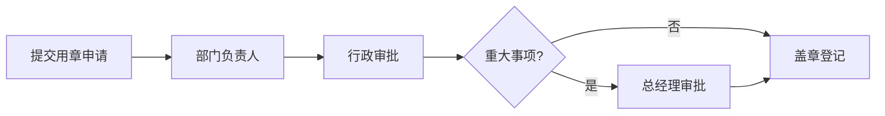

# 星云智联科技有限公司 用章审批流程

| 版本 | 生效日期 |
| --- | --- |
| V1.0 | 2024-01-01 |

---

## 一、流程说明

公司印章使用须在 OA 提交用章申请，经部门负责人、行政审批，重大事项由总经理审批后进行盖章登记存档。

## 二、审批流程图

```text
申请人提交用章申请
    ↓
部门负责人审批
    ↓
行政审批 / 用印
    ↓
重大事项加签总经理
    ↓
盖章 + 登记存档
```

### 标准流程图（mermaid）



## 三、印章类型与权限

| 印章 | 使用场景 | 主要审批 |
| --- | --- | --- |
| 公章 | 对外正式文件 | 行政/总经理 |
| 合同章 | 合同签署 | 行政（关联合同流程） |
| 财务章 | 财务票据、文件 | 财务部 |
| 法定代表人章 | 法定事项 | 总经理 |

## 四、用章登记与存档

- 每次用印须登记：用章类型、文件名称、用途、日期、经办人。
- 用印文件副本统一存档备查。

## 五、外借规定

- 印章原则上不得外带；确需外借须经总经理批准并登记归还。

## 六、注意事项

- 未经审批、登记不得用印。
- 严禁在空白文件上预先用印。

---

## 附则

本流程与《合同审批流程》关联执行，用章合规由行政部负责。