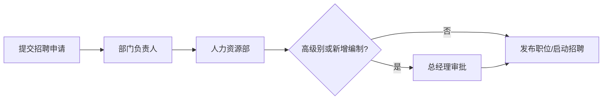

# 星云智联科技有限公司 招聘申请流程

| 版本 | 生效日期 |
| --- | --- |
| V1.0 | 2024-01-01 |

---

## 一、流程说明

用人部门需补充人员时，在 OA 提交招聘申请，经部门负责人、人力资源部审批，高级别岗位由总经理审批，审批通过后由 HR 组织招聘。

## 二、审批流程图

```text
用人部门提交招聘申请
    ↓
部门负责人审批
    ↓
人力资源部审批
    ↓
总经理审批（高级别/新增编制）
    ↓
获批 → 发布职位 / 启动招聘
```

### 标准流程图（mermaid）



## 三、审批节点与规则

| 节点 | 审批人 | 说明 |
| --- | --- | --- |
| 1 | 部门负责人 | 岗位需求与必要性 |
| 2 | 人力资源部 | 编制、预算、招聘方案 |
| 3 | 总经理 | 高级别岗位或新增编制加批 |

## 四、申请内容

- 岗位名称、职级、招聘人数、岗位职责、任职要求、招聘渠道与到岗时间。

## 五、招聘协同

- 审批通过后由 HR 发布职位，用人部门配合简历筛选与面试。

## 六、注意事项

- 未经审批不得擅自承诺录用或发布招聘。
- 招聘结果与录用流程由人力资源部统一管理。